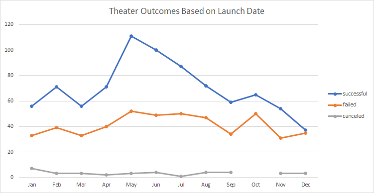
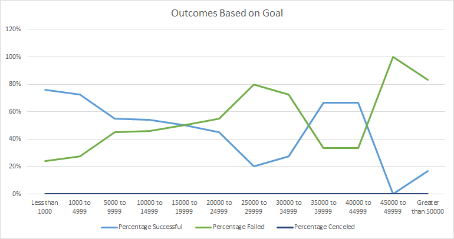

# Kickstarting with Excel

## Overview of Project
An observation of various Kickstarter campaigns in different fields. This anaylsis will help clients determine the appropriate budget, avenue, and season for launching a kickstarter campaign to guarentee success and avoid pitfalls.  

### Purpose
To analyize various campaigns to determine successes vs. failures with the variables of time, type, and monetary goals. 

## Analysis and Challenges
 
### Analysis of Outcomes Based on Launch Date
I calculated the number of successful, failed, and canceled campaigns based on the category of theater. I then produced a line graph visializing the results and came to conclusions based on these observations.

### Analysis of Outcomes Based on Goals
I created a chart based on the various monetary goals of each campaign and disected the values into $5000 incriments. I then caluclated the amount of successful, failed, and canceled campaigns within those $5000 increments and the total amount of all campaigns within those incriments. Additionally, I calcuated the percent of successful, failed, and canceled campagins based on their goal amount and produced into a line graph for visualization. 

 
### Challenges and Difficulties Encountered
I stuggled initially with the order of my COUNTIFS() formula, but was able to figure it out with the help of the hint video. 

## Results

- I've observed that, in the variable of time, campaigns for theater launched in the months of May-July are the most successful, so it would be ideal to launch during that time. Additionally, the campaigns launched in the months of October-January were the least successful, so it would be risky to launch during that time. 

- I saw that campaigns with goals at $5,000 or less have the highest chance of succeeding, in comparison to higher goals.

- Although there was a high percent of sucessful campaigns in the $35000-$45000 range, the total number of launched campaigns was microscopic in comparision to the number of successful campaigns under $5000. This indicates an outlier of information and launching a campaign in the #35000-$45000 range would still be considered risky. 

- We could use a box plot or a pie chart to observe the outcomes based on goals chart. 
